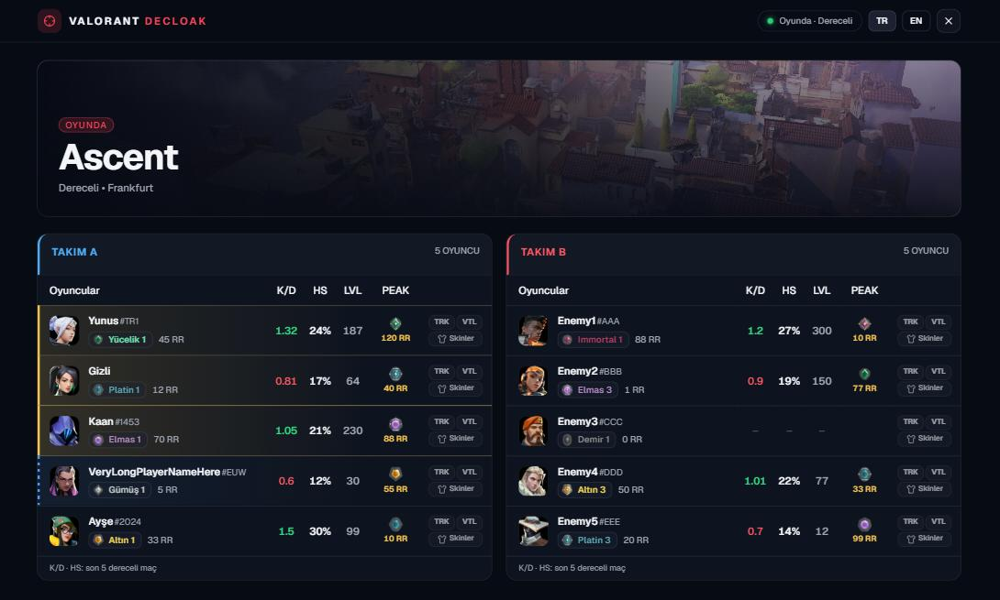
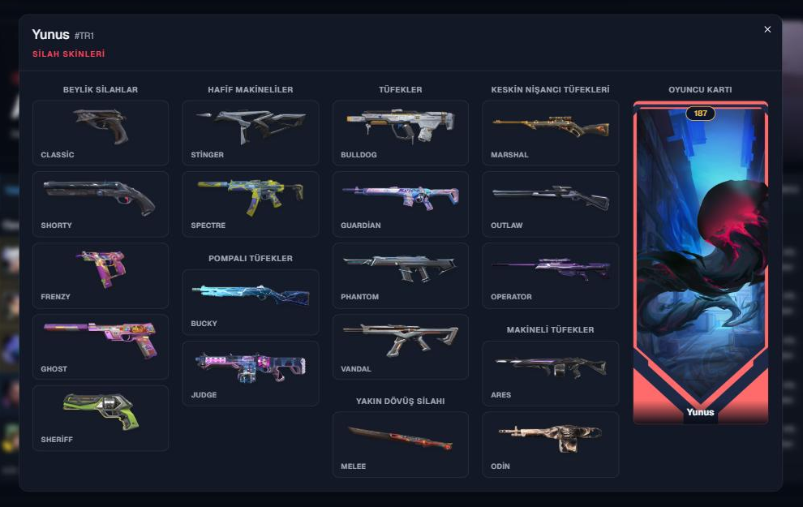

<h5 align="center"> VALORANT DECLOAK</h5>

[![Discord][discord-shield]][discord-url]
[![Downloads][downloads-shield]][downloads-url]

Valorant Decloak shows the names (including hidden/streamer-mode players),
ranks, peak ranks, and stats of the players in your game in a local web panel
while VALORANT is open. There is no license/HWID check, the program runs
entirely locally, and the interface is in Turkish.

---

  <ol>
    <li><a href="#about-the-project">About The Project</a></li>
    <li><a href="#features">Features</a></li>
    <li><a href="#usage">Usage</a></li>
    <li><a href="#configuration">Configuration</a></li>
    <li><a href="#contributing">Contributing</a></li>
    <li><a href="#contact">Contact</a></li>
    <li><a href="#acknowledgements">Acknowledgements</a></li>
    <li><a href="#disclaimer">Disclaimer</a></li>
  </ol>


## About The Project

The panel shows every player's rank, RR, peak rank, K/D, headshot %, level, and
party grouping at a glance. K/D and HS % are calculated from each player's last
5 competitive matches:



Clicking "Skins" on a player opens their in-match loadout:




## Features

- **Local web panel**: Everything is shown in a native window (webview) that
  opens alongside the game, so there's no need to open a separate browser tab.
  Closing the panel window closes the program as well. If pywebview isn't
  available, the panel automatically falls back to your default browser.
- **Hidden name resolution (decloak)**: Real nicknames of streamer-mode/hidden
  players are resolved via the Henrik API (set `henrikdev_api_key` in
  `config.json`); if that fails, a plain `Gizli` label is shown, and clicking it
  copies the player's PUUID.
- **Account level**: The level Riot reports is used as-is. Only when Riot hides
  it (it comes back as `0`, empty, or `N/A`) is the level looked up through the
  Henrik API, so no extra requests are made for players whose level is visible.
  Without an API key, hidden levels are simply not shown.
- **Last 5 competitive matches**: K/D and HS % are calculated from Riot's own
  match history and are shown only once they are actually loaded. Players with
  no competitive matches (or when Riot returns an error) show no K/D/HS at all.
- **Loads in the background**: The panel opens immediately with names, ranks, and
  peak ranks; slower data (stats, hidden names, levels) is filled in as it
  arrives. Rank and agent icons are retried automatically and cached in your
  browser, so a slow `valorant-api.com` does not leave them blank.
- **No license/HWID check**: The program runs entirely locally without
  connecting to any license server.
- **Turkish interface**: All messages and game modes shown in the panel are in
  Turkish (an English option is available from the language switch).
- Also shows the current skin loadout (per player, in-game), party/premade
  grouping, and Discord Rich Presence.


## Usage
**VALORANT must be open**.

### Bundled Release:

1) Download [Microsoft Visual C++ Libraries](https://github.com/abbodi1406/vcredist/releases)
2) Download the [release](https://github.com/tcoyemre/valorantdecloak/releases/latest).
3) Extract **all** files.
4) Optionally, put your own HenrikDEV API key in `config.json`.
5) Run `Decloak.exe`.

### Running from source:

1) Download Python [3.11](https://www.python.org/downloads/release/python-3119/) or [3.10](https://www.python.org/downloads/release/python-31011/), make sure it is added to the PATH. (This is an option on installation.)
2) Download the [source](https://github.com/tcoyemre/valorantdecloak/archive/refs/heads/main.zip).
3) Run **`INSTALL.bat`** file (or use `pip install -r requirements.txt` in the terminal)
4) Run **`START.bat`** file (or use `python main.py` in the terminal)

You can also run `python main.py --config` to open the interactive settings menu.

### Compiling from source code:

1) `pip install cx_Freeze`
2) `python setup.py build`
3) Open the new Build folder and find `Decloak.exe`.


## Configuration

Settings live in `config.json` (created with defaults on first run). You can edit
it by hand or run `python main.py --config` for the interactive menu.

| Key | Default | Description |
| --- | --- | --- |
| `henrikdev_api_key` | `""` | [HenrikDEV API key](https://api.henrikdev.xyz/dashboard/api-keys/). Needed to resolve hidden names and hidden levels. `YOUR_APIKEY` is treated as "no key". |
| `port` | `1100` | Port of the local web panel. |
| `weapon` | `"Vandal"` | Weapon whose skin is shown for each player. |
| `cooldown` | `10` | Legacy setting; only `0` has an effect (waits for Enter between refreshes when a console is attached). |
| `flags.peak_rank_act` | `true` | Show the act the peak rank was reached in (e.g. `e5a2`) next to the peak rank icon. |
| `flags.discord_rpc` | `true` | Enable Discord Rich Presence. |

Free Henrik API keys are limited to roughly 30 requests per minute. Successful
lookups are cached for an hour and failed ones are retried after 30 seconds.

## Developing the panel

The panel UI is a React + Tailwind + [shadcn/ui](https://ui.shadcn.com) app whose
source lives in `panel-src/`. `web/` only holds the compiled output that the
Python server serves, so end users need no Node.js.

```bash
cd panel-src
npm install
npm run dev      # hot reload; /data, /info, /quit, /lang are proxied to localhost:1100
npm run build    # compiles into ../web (commit the result)
```

Add new shadcn components with `npx shadcn@latest add <name>`.

## What about that Tweet?

The [Tweet](https://twitter.com/PlayVALORANT/status/1539728676815642624), which details Riot's API policies

## Contributing

Any contributions you make are **greatly appreciated**.

## Contact

Join the my discord:

[![Discord Banner 2][discord-banner]][discord-url]

## Acknowledgements

- [Valorant-API.com](https://valorant-api.com/)
- [HenrikDEV](https://henrikdev.xyz/)
- [HenrikDEV API KEY](https://api.henrikdev.xyz/dashboard/api-keys/)

## Disclaimer

This project is not affiliated with Riot Games and is not endorsed by Riot Games. Riot Games and all related assets are trademarks or registered trademarks of Riot Games, Inc.

You acknowledge that the risk of using this software is entirely your own.


[discord-shield]: https://img.shields.io/discord/1464955156180242434?color=7289da&label=Support&logo=discord&logoColor=7289da&style=for-the-badge
[discord-url]: https://discord.gg/jbknGqMrN9
[discord-banner]: https://discordapp.com/api/guilds/1464955156180242434/widget.png?style=banner2

[downloads-shield]: https://img.shields.io/github/downloads/tcoyemre/valorantdecloak/total?style=for-the-badge&logo=github
[downloads-url]: https://github.com/tcoyemre/valorantdecloak/releases/latest
